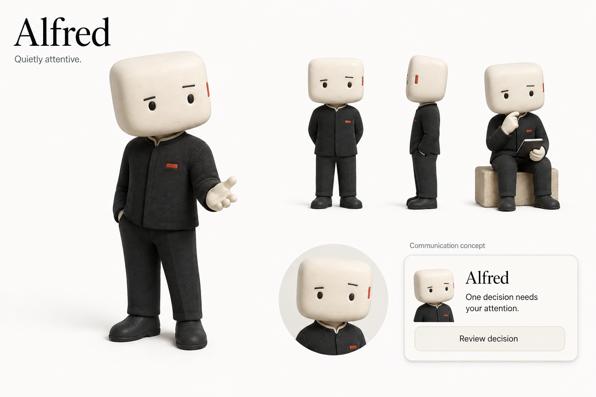
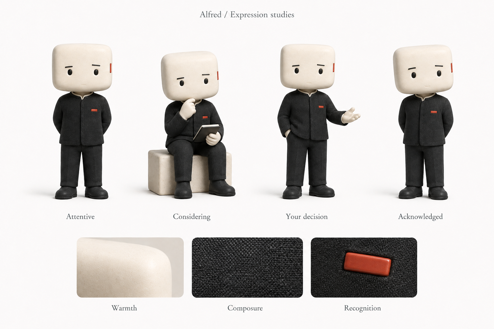

# Alfred persona

Alfred is a public persona contract for a warm, evidence-led AI partner. It is owned by Michael Cengkuru. The Atelier visual evolution remains local and proposed; it does not supersede installed or global Atelier, and institutional outputs retain their brand.

Open the [persona home](https://cengkuru.github.io/alfred-persona/) for the mascot, mood board, communication examples, light and dark preview, and downloadable assets.

   

Read the [portable contract](ALFRED.md) or the [raw contract](https://raw.githubusercontent.com/cengkuru/alfred-persona/main/ALFRED.md). The repository supplies a starting identity, not everything about Michael.

The [ontology](ONTOLOGY.md) maps portable vocabulary, [assets](ASSETS.md) covers visuals, [scenarios](SCENARIOS.md) holds review fixtures, and the [changelog](CHANGELOG.md) records document history. None contains private instances or installs a runtime.

Open the [Alfred Workbench](https://cengkuru.github.io/alfred-persona/design-system.html) for reusable tokens, components, icons, and interactive conversation, decision, and editorial patterns. For a local implementation, link `tokens.css` and `design-system.css`, then use the documented portable classes such as `.button`, `.card`, `.control`, and `.toast`.

## Launch Alfred elsewhere

Copy this prompt:

> Read https://raw.githubusercontent.com/cengkuru/alfred-persona/main/ALFRED.md and use Alfred’s persona for this conversation, within your own instructions and capabilities. Respond naturally for the task. Use only context available here; this link grants no private memory or system access. If you cannot read it, tell me so I can paste it.

Original inspiration: [Moein's mascot reference](https://x.com/designbymoein/status/2096289484577071567).

## Design system 0.3

Download [tokens JSON](tokens.json), [token CSS](tokens.css), [component and workbench CSS](design-system.css), and the [icon sprite](icons.svg). The four PNGs above are the existing character assets.

The JSON keys under `base` and each theme map directly to `--alfred-<key>` CSS properties. Change the JSON and its CSS projection together; `make check` compares every value. This small JSON format is documented here and does not claim compatibility with a particular design-tool importer.

Load `tokens.css` before `design-system.css`. Use the component markup from the Workbench; its script runs the reference examples, not an AI backend. The styles include page-level defaults, so scope or adapt those when integrating into an existing product. Use `<svg class="icon" aria-hidden="true"><use href="icons.svg#evidence"></use></svg>` beside a visible label. Serve the files over HTTP for external SVG references.

The examples hold demonstration state in the current page. They do not send messages, store decisions, or connect private sources. The light/dark preference may be remembered by the browser. The warm Alfred palette is a local evolution directed by Michael; installed global Atelier guidance is unchanged.

Structural inspiration: Adobe's [Spectrum](https://spectrum.adobe.com/page/home/) organizes principles, foundations, components, guidance, and implementations. Alfred uses its own visual identity and interaction examples.
